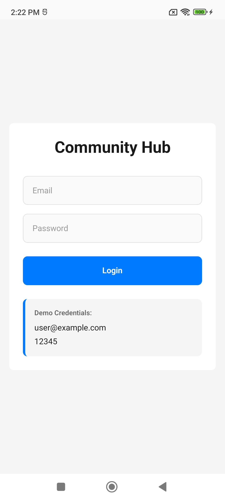
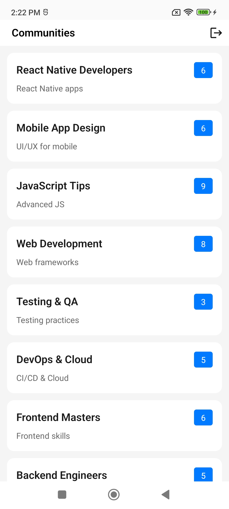
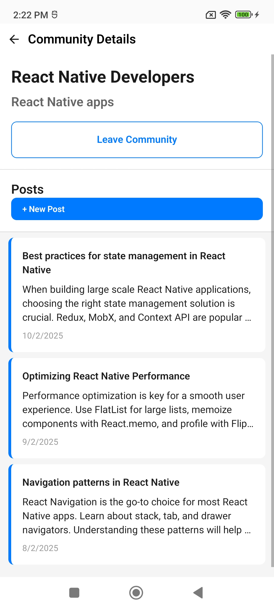

# Community Hub

## Getting Started

### Prerequisites

- **Node.js**: v22.18.0
- **Java**: 17.0.17 (2025-10-21)

### Backend Setup (JSON Server)

1. Clone the repository:

```bash
git clone https://github.com/Rahul54193/Mockserver/tree/main
cd Mockserver
```

2. Install dependencies and start the server:

```bash
npm install
npm start
```

The server will start on port 3000.

### App Installation

1. Clone the repository:

```bash
git clone https://github.com/Rahul54193/CommunityHub/tree/main
cd CommunityHub
```

2. Install dependencies:

```bash
npm install
```

3. **Network Configuration**:
   - Ensure your device is connected to the same WiFi network as the backend server
   - Check the configuration in `src/api/client.ts`

4. Run the app:

```bash
npm run android
```

5. Test credentials

   user@example.com
   12345

## Architecture Overview

### Tech Stack

- **React Native** - Mobile framework
- **TanStack Query** - Data fetching and caching
- **Zustand** - State management
- **TypeScript** - Type safety
- **React Native Paper** - UI icons
- **JSON Server** - Mock backend

### Folder structure

```
├── api
├── components
│   ├── ErrorBoundry
│   ├── ErrorDisplay
│   ├── Header
│   ├── OfflineIndicator
│   ├── SkeletonLoader
│   └── Toast
├── hooks
│   ├── mutations
│   └── queries
├── Navigation
├── screens
│   ├── ComunityDetails
│   ├── CreatePost
│   ├── Home
│   └── Login
├── services
│   └── api
├── state
│   └── store
├── styles
└── utils
```

### Key decisions & tradeoffs 

**TanStack/React Query**
- Automatic caching, refetching, and synchronization
- Reduces boilerplate for async operations

**Zustand over Redux**
- Simpler API with less boilerplate code
- Sufficient for current app complexity

**Storage Strategy**
- React Native Keychain for sensitive data over Local storage.

**UX Enhancements**
- Keyboard dismiss on tap for better mobile experience

## Screenshots

<p>
   
   
   
   
</p>

## What you’d improve with more time

Given more time, the following enhancements would be implemented:

- [ ] Splash screen on app launch
- [ ] Search and member count filters on the community list screen
- [ ] Theming dark and light
- [ ] Internationalized (i18n) multilingual app  
- [ ] Unit tests using React Native Jest
- [ ] Real-time updates via WebSocket integration
- [ ] Environment variables for development, staging, and production
- [ ] Custom app icons
- [ ] UI can be made more better